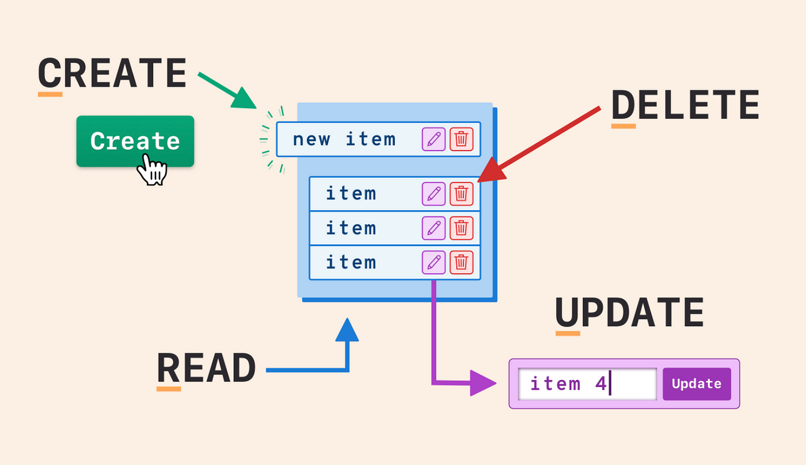

# Spring Boot `CRUD` Demo



- Spring Boot CRUD demo is demonstrating how to implement simple CRUD operations with a `user` entity.

<br>

This project is based on the Spring Boot project and uses these packages:

[](https://www.java.com/en/)

[](https://spring.io/)

[](https://www.java.com/en/)

[](https://www.postgresql.org/)

[](https://projectlombok.org/)

[](https://www.java.com/en/)

<br>

### Installation

- The project is created with Maven, so you just need to import it to your IDE and build the project to resolve the dependencies

<br>

### Database configuration

- Create a PostgreSQL database with the name `users` and add the credentials to `/resources/application.yml`

The default ones are :

```yml

spring:
  datasource:
    url: jdbc:postgresql://localhost:5432/users
    username: postgres
    password: ****

```

<br>

### Usage

Run the project through the IDE and head out to `http://localhost:8080/`
or
run this command in the command line:

```bsh
mvn spring-boot:run
```

<br>

# License

This project is licensed under the MIT License. See the [LICENSE](LICENSE) file for details

Created by [Mehmet Furkan KAYA](https://www.linkedin.com/in/mehmet-furkan-kaya/)
